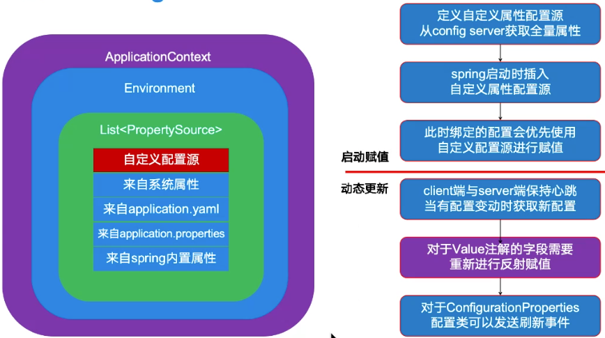

# czConfig 配置中心
[czConfig](https://github.com/zjianru/czConfig)是一个持久化的配置中心中间件。
从头创建一个配置中心 逐步完成高级功能  并与 czRpc 集成

模型参考 apollo 和 nacos 这里简要介绍其背景和原理

一个完整的配置中心 包括 server 和 client 两部分

server 保存所有的持久化配置数据 client 可以通过 server 提供的 API 拿到所有的需要的配置集合  
并且在 server 端数据变化时拿到新的配置数据

与 spring 集成:
springboot 里存在两种配置的绑定方式
一个是通过 @Value 注解绑定的属性
一个是通过 configurationProperties 绑定的属性类

需要考虑这两种不同配置方式的处理

## 项目包括如下几个部分

* [czConfig-server](./czConfig-server)：配置中心服务端，负责配置的存储、发布、同步等。czConfig-server：配置中心服务端，负责配置的存储、发布、同步等。
* [czConfig-client](./czConfig-client)：配置中心客户端，负责配置的获取、更新等。
* [czConfig-demo](./czConfig-demo)：czConfig-demo: 配置中心客户端demo。

## 当前进展

* czConfig-server 完成v1实现三个接口。

## 配置中心替换配置原理

### 配置替换逻辑
#### 启动时替换配置
入口: `EnableCzConfig`
注解中 import 了启动逻辑 `BeanRegistrar` , 实现 `ImportBeanDefinitionRegistrar` 接口,注入 `PropertySourcesProcess` 处理器进行逻辑处理

`PropertySourcesProcess` 负责获取配置中心配置并将配置打包为 `CompositePropertySource` 注入进 `ConfigurableEnvironment` 中

#### 主动替换配置
1. 定时任务线程轮询,版本号变更时发送刷新事件,交由 spring 完成配置刷新

相关实现代码 `com.cz.config.client.reporsitory.invoke.HttpRepo#heartBeat`

2. spring value 方式需要额外进行反射处理